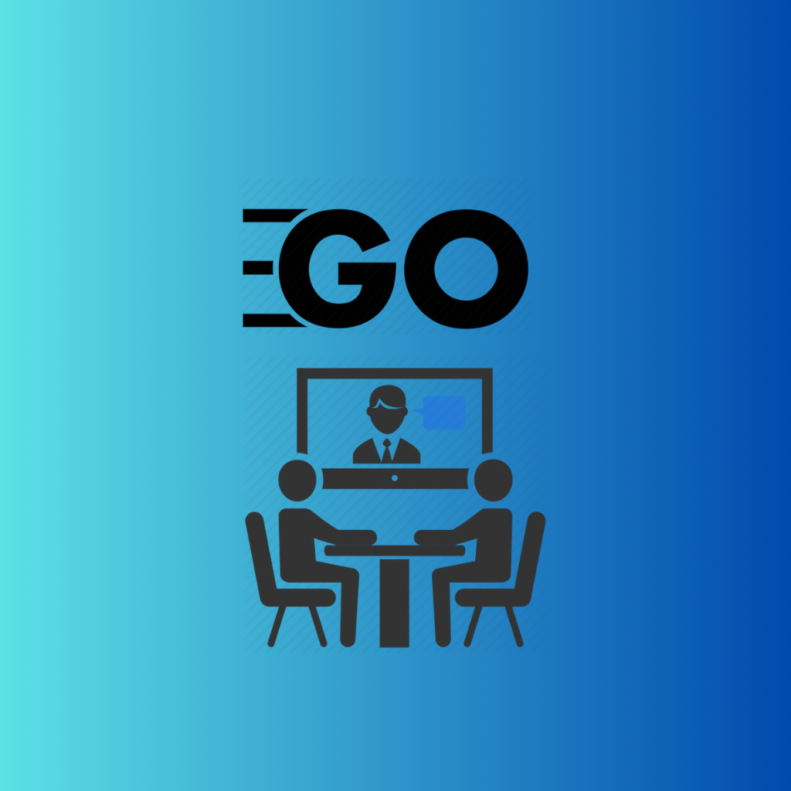

# Go Meets

	

## What

“Go Meets” is envisioned as an intuitive video conferencing platform aimed at providing seamless communication without unnecessary complexity. Users can engage in video meetings effortlessly, without the need for creating accounts or installing software.

## Features

**Accountless**  
No need to create any account to use Go Meets, Just use it!

**No installation**  
No need to do any installations to use Go Meets.

**No money charge**  
Free, forever.

## Technologies used

- Pion/WebRTC
- Pion/Turn
- Fiber
- FastHTTP Websocket

## Installation

## Steps to use "Go Meets"
