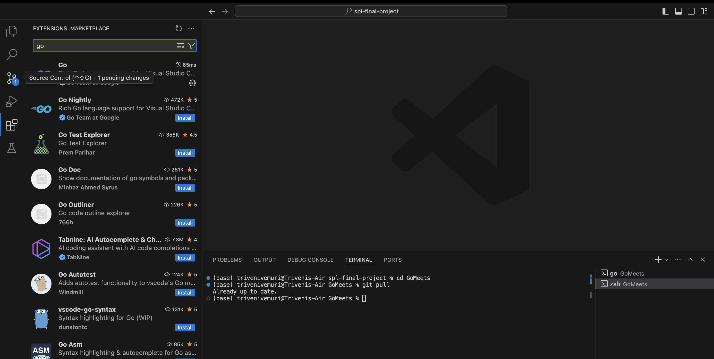
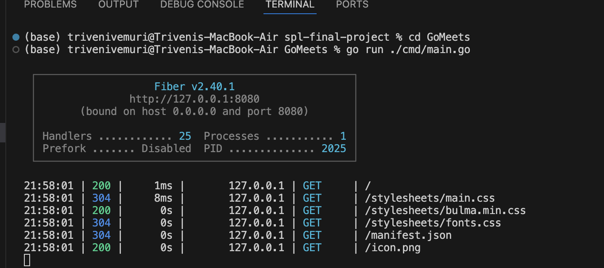
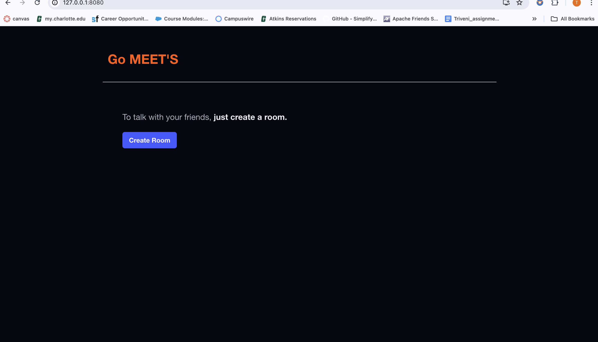

# Go Meets

	

## What

“Go Meets” is envisioned as an intuitive video conferencing platform aimed at providing seamless communication without unnecessary complexity. Users can engage in video meetings effortlessly, without the need for creating accounts or installing software.

## Features

**Accountless**  
No need to create any account to use Go Meets, Just use it!

**No installation**  
No need to do any installations to use Go Meets.

**No money charge**  
Free, forever.

## Technologies used

- Pion/WebRTC
- Pion/Turn
- Fiber
- FastHTTP Websocket

## Installation
In visual Studio Go to Extensions and install Go in MarketPlace

	

## Steps to use "Go Meets"
Go to the project Location 
Execute the below command
  go run ./cmd/main.go

	

Now you can view the page below

	

you can create a room 
give the link to the other person to join in the meet 
you can chat with other person

go.mod 

The file 'go.mod' is a module in the Go programming language. The 'go.mod' file specifies the module's attributes, including its dependency on other Go modules. It is a crucial component of the Go module system, which manages dependencies.

Here's what typically goes into a 'go.mod' file:

1. Module Declaration: This specifies the current module's path, which is also the base path used to resolve import statements within the module.
2. Go Version: This line specifies the Go version used for the module. It ensures compatibility and consistency when the module is used in different environments.
3. Require Statements: These lines list the specific versions of external Go modules that this module depends on. Each line includes the module path and its version.

go.sum
'go.sum' is a checksum file used alongside the 'go.mod' file in Go programming projects. The 'go.sum' file serves as a security feature to ensure the integrity and authenticity of the modules used in a project.

Here’s a simple explanation of what the 'go.sum' file does and why it's important:

1. Checksums for Dependencies: 'go.sum' contains cryptographic hashes for each version of each dependency listed in your `go.mod` file. These hashes are generated when you first download the dependencies and are checked every time the dependencies are used.

2. Verification: The purpose of storing these checksums is to verify that the module files you download are the same as those originally used when the `go.sum` file was created. This prevents tampering or accidental corruption of module files.

3. Dependency Integrity: When you build your project, Go checks the hashes in the `go.sum` file against the hashes of the downloaded modules. If they don't match, Go will report an error and stop the build, alerting you to a potential integrity issue with your dependencies.

4. No Manual Editing: The `go.sum` file is automatically managed by the Go tools. You generally should not need to manually edit this file. When you add, update, or remove dependencies using Go commands like `go get` or `go mod tidy`, Go automatically updates the `go.sum` file.

